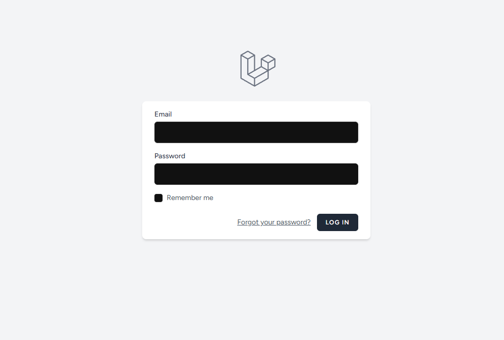
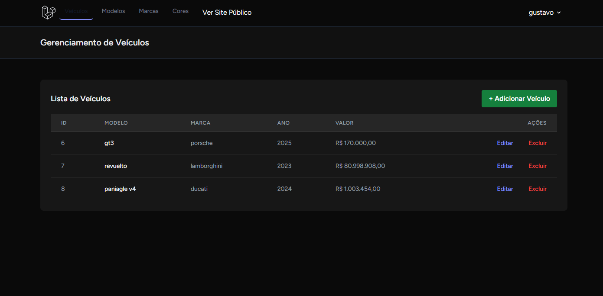
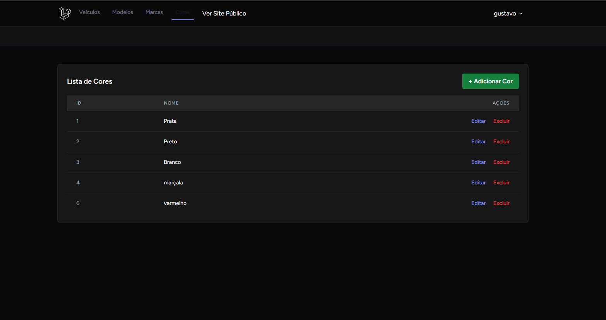

#Site de Venda de Veículos (Projeto Laravel)

Este projeto simula um portal de vendas de automóveis (similar ao Webmotors ou iCarros), desenvolvido com **Laravel** e **Tailwind CSS**.

O sistema possui uma **Área Pública** (para visitantes) e uma **Área Administrativa** (protegida por login) para o gerenciamento completo (CRUD) do conteúdo.

**Status do Projeto:** 100% Concluído.

##Credenciais de Acesso (Administrador)

Para aceder à Área Administrativa, utilize as seguintes credenciais:

| Utilizador (Email) | Palavra-passe |
| :--- | :--- |
| `admin@gmail.com` | `12345678` |

Após o login, você será redirecionado para o painel principal em `/admin/veiculos`.

##Como Rodar o Projeto

Siga estes passos para configurar e executar o projeto na sua máquina local.

### Pré-requisitos

  * PHP e Composer
  * Node.js e NPM
  * Um servidor MySQL (XAMPP)

### 1\. Setup Inicial

1.  **Clone o repositório:**

    ```bash
    git clone [URL_DO_REPOSITORIO]
    cd [NOME_DA_PASTA_DO_PROJETO]
    ```

2.  **Instale as dependências do PHP:**

    ```bash
    composer install
    ```

3.  **Instale as dependências do Frontend (NPM):**

    ```bash
    npm install
    ```

4.  **Crie o seu ficheiro `.env`:**

    ```bash
    cp .env.example .env
    ```

5.  **Gere a Chave da Aplicação:**

    ```bash
    php artisan key:generate
    ```

### 2\. Configuração do Banco de Dados

1.  **Inicie o seu MySQL** (pelo XAMPP, etc.).
2.  No seu **phpMyAdmin**, crie um novo banco de dados. (O nome `venda_veiculos` é recomendado).
3.  **Edite o ficheiro `.env`** com as informações do seu banco:
    ```env
    DB_CONNECTION=mysql
    DB_HOST=127.0.0.1
    DB_DATABASE=venda_veiculos
    DB_USERNAME=root
    DB_PASSWORD=
    ```

### 3\. Migração e Dados Iniciais

1.  **Crie todas as tabelas** (Users, Marcas, Cores, Modelos, Veículos, etc.):

    ```bash
    php artisan migrate:fresh
    ```

2.  **Registe-se como Administrador:**

      * Antes de popular o site, rode os servidores (ver Passo 4) e acesse `http://127.0.0.1:8000/register`.
      * **Crie a conta de administrador** com as credenciais `admin@gmail.com` e `12345678`.

3.  **Popule o Banco de Dados (SQL):**

      * Após se registar, vá ao **phpMyAdmin**, selecione o banco `venda_veiculos` e clique na aba **"SQL"**.
      * Execute os comandos `INSERT` abaixo para adicionar os dados iniciais com os links das imagens online:

    <!-- end list -->

    ```sql
    INSERT INTO `marcas` (nome, created_at, updated_at) VALUES
    ('Volkswagen', NOW(), NOW()), ('Chevrolet', NOW(), NOW()), ('Fiat', NOW(), NOW()), ('Lamborghini', NOW(), NOW());

    INSERT INTO `cors` (nome, created_at, updated_at) VALUES
    ('Prata', NOW(), NOW()), ('Preto', NOW(), NOW()), ('Branco', NOW(), NOW());

    INSERT INTO `modelos` (marca_id, nome, created_at, updated_at) VALUES
    (1, 'Gol', NOW(), NOW()), (2, 'Onix', NOW(), NOW()), (3, 'Strada', NOW(), NOW()), (4, 'Huracan', NOW(), NOW());

    INSERT INTO `veiculos` ( `modelo_id`, `cor_id`, `ano`, `quilometragem`, `valor`, `detalhes`, `foto_1`, `foto_2`, `foto_3`, `created_at`, `updated_at`) 
    VALUES

    ( 4, 3, 2021, 9000, 2800000.00, 'Lamborghini Huracan Branca, pouquíssimo rodada, estado de 0km.', 'https://cdn.veloce.it/wp-content/uploads/2021/11/Lamborghini-Hurac%C3%A1n-Paolo-Troilo-10.jpg', 'https://cdn.veloce.it/wp-content/uploads/2021/11/Lamborghini-Hurac%C3%A1n-Paolo-Troilo-10.jpg', 'https://www.corriere.it/methode_image/2021/11/04/Motori/Foto%20Motori%20-%20Trattate/07.%20Minotauro_CENTRE-kJWF-U33006896486714b-593x443@Corriere-Web-Sezioni.jpg', NOW(), NOW());
    ```

### 4\. Executar o Projeto

É necessário rodar **dois** servidores em **dois** terminais diferentes:

1.  **Terminal 1 (Compilador de Estilos/JS):**
    ```bash
    npm run dev
    ```
2.  **Terminal 2 (Servidor PHP):**
    ```bash
    php artisan serve
    ```

O site estará disponível em `http://127.0.0.1:8000/`.

##Prints de Tela :


**1. Página Inicial (Listagem)**


**2. Página de Detalhes do Veículo**


### Área Administrativa

**3. Gerenciamento de Veículos**


**4. Formulário de Adicionar Veículo**


**5. Gerenciamento de Modelos**


**6. Gerenciamento de cores**


**7. Gerenciamento de marcas**

